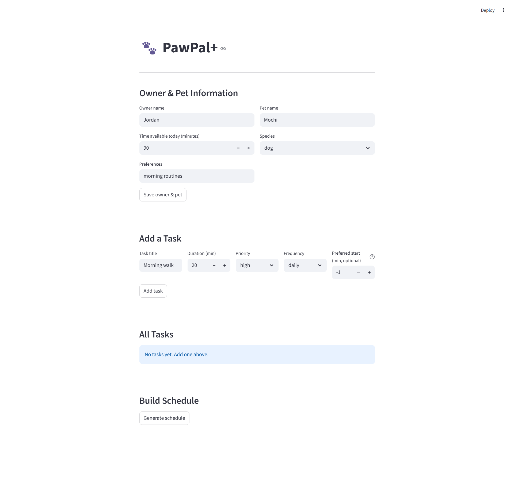

# 🐾 PawPal+

> A smart daily pet-care scheduler built with Python and Streamlit.  
> PawPal+ helps busy pet owners stay consistent by generating a conflict-free, priority-sorted care plan every day — and explaining exactly why each task was placed where it was.

---

## 📸 Demo



> **To add your screenshot:** run `streamlit run app.py`, take a screenshot of the app, save it as `docs/screenshot.png`, and the image above will appear automatically.

---

## ✨ Features

### 1. Priority-Based Scheduling
Tasks are ranked `high → medium → low` using an internal `PRIORITY_ORDER` constant. When multiple tasks compete for limited time, higher-priority tasks are slotted first. Within the same priority tier, shorter tasks are placed before longer ones to maximise the number of tasks completed.

### 2. Preferred Start Times
Any task can declare a `preferred_time` — a fixed offset in minutes from 8:00 AM. The scheduler places preferred-time tasks first (at their exact requested slot), then fills remaining gaps with flexible tasks. This lets owners lock in time-sensitive routines like morning feeding at 8:00 or an evening walk at 5:30 PM.

### 3. Recurrence Rules (Daily / Weekly / Once)
Every task carries a `frequency` and a `last_completed_date`. The `is_due_today()` method enforces three recurrence modes:
- **`daily`** — due every calendar day; skipped if already completed today
- **`weekly`** — due again once ≥ 7 days have passed since last completion (exact boundary)
- **`once`** — appears exactly one time; removed from future schedules after completion
- **unknown frequency** — treated as always due (safe fallback)

### 4. Chronological Sorting
`sort_by_time()` returns the generated schedule ordered earliest-to-latest by start offset, using Python's stable `sorted()`. Tasks at the same minute preserve their original insertion order. The Streamlit UI always displays the sorted view so owners see their day in time order.

### 5. Conflict Detection
`detect_conflicts()` compares every pair of scheduled tasks using a half-open interval test `[start, start+duration)`. Overlapping pairs produce plain-English warning strings labelled either:
- **same pet** — two tasks for the same animal overlap
- **cross-pet** — tasks for two different animals overlap

Adjacent tasks (one ends exactly when the next begins) are correctly treated as non-conflicting. Warnings appear in the UI via `st.warning()` so they are visible without crashing the app.

### 6. Smart Slot-Filling
The internal `_find_free_slot()` algorithm finds the earliest available gap for each flexible task in O(n log n) time. It sorts occupied intervals, then scans left-to-right advancing past each block until a gap large enough for the task's duration is found — or returns `None` if the day's time budget is exhausted.

### 7. Task Filtering
`filter_tasks()` provides case-insensitive filtering by pet name and/or completion status. The UI exposes this as a radio button (`all / pending / completed`) so owners can focus on what still needs doing.

### 8. Transparent Reasoning
`explain_plan()` produces a human-readable log of every scheduling decision — which tasks were placed and why, which were skipped and why (preferred time overrun, no free slot), and a total time-used summary. Displayed in a collapsible expander in the UI.

---

## 🗂 Project Structure

```
pawpal_system.py   Core data model and scheduling logic (Task, Owner, Pet, Scheduler)
app.py             Streamlit UI — owner setup, task entry, schedule display
pytest/
  test_pawpal.py   16-test suite covering sorting, recurrence, and conflict detection
uml_final.md       Mermaid class diagram (renders on GitHub)
uml_final.png      Class diagram as a static PNG
```

---

## 🚀 Getting Started

### Prerequisites

- Python 3.10+
- pip

### Setup

```bash
python -m venv .venv
source .venv/bin/activate      # Windows: .venv\Scripts\activate
pip install -r requirements.txt
```

### Run the app

```bash
streamlit run app.py
```

Open [http://localhost:8501](http://localhost:8501) in your browser.

---

## 🧪 Testing PawPal+

### Run all tests

```bash
python -m pytest pytest/test_pawpal.py -v
```

### What the tests cover

| Area | Tests | What is verified |
|---|---|---|
| **Sorting correctness** | 3 | `sort_by_time()` returns tasks chronologically; ties preserve insertion order (stable sort); calling before `generate_schedule()` returns `[]` safely |
| **Recurrence logic** | 7 | Daily tasks skip same-day repeats; weekly tasks respect the exact 7-day boundary; `"once"` tasks never reappear; `generate_schedule()` sets `last_completed_date` so tomorrow's due-check is correct |
| **Conflict detection** | 4 | Same-pet overlaps produce `"same pet"` warning; cross-pet overlaps produce `"cross-pet"` warning; adjacent tasks are not flagged; identical start times are always flagged |
| **Core behaviour** | 2 | `mark_complete()` sets `completed = True`; `add_task()` increases the pet's task count |

### Confidence Level

**★★★★☆ 4 / 5**

The suite covers all three critical areas including boundary conditions. The one gap is dedicated unit tests for `_find_free_slot` edge cases (fragmented gaps, zero budget), which are currently exercised only indirectly through integration tests.

---

## 🗺 Architecture

See [uml_final.md](uml_final.md) for the full Mermaid class diagram, or [uml_final.png](uml_final.png) for a static version.

**Class relationships at a glance:**

```
Owner ──◆── 0..* Pet ──◆── 0..* Task
                 │
            Scheduler ──uses──▶ Owner
            Scheduler ──schedules──▶ Task
```

- `Owner` and `Pet` are **compositions** — pets belong to an owner, tasks belong to a pet
- `Scheduler` is a **controller** — it reads the owner's full task graph, applies recurrence + priority rules, and returns a timed schedule
- `PRIORITY_ORDER` is a **module constant** consumed by `Scheduler.generate_schedule()`

---

## 📋 Scenario

A busy pet owner needs help staying consistent with pet care. PawPal+ addresses three pain points:

1. **Forgetting recurrence** — daily and weekly tasks are tracked automatically; the owner never has to remember what was done yesterday
2. **Time overcommitment** — the scheduler fits tasks into the available time budget and explains what was skipped and why
3. **Scheduling conflicts** — overlapping care windows are surfaced as warnings before the day begins, so the owner can adjust rather than discover conflicts mid-routine
